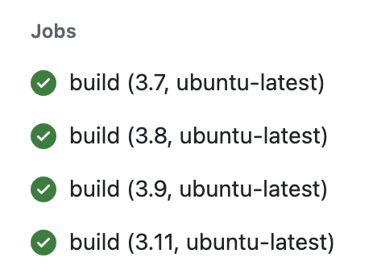

# IDS706 - Mini Project 4 - Ailina Aniwan

## GitHub Actions Matrix Build for Multiple Python Versions

### Project Overview
This project is part of the IDS 702: Data Engineering course and demonstrates how to ensure Python code compatibility across different environments using GitHub Actions. By configuring a matrix strategy, the workflow tests Python versions 3.7, 3.8, 3.9, and 3.11, ensuring consistent performance and stability across these versions.

### Key Features
* Matrix Strategy: Tests run across Python 3.7, 3.8, 3.9, and 3.11 in parallel.
* Automated Testing: Each commit triggers tests, providing immediate feedback on code compatibility.
* Cross-Version Support: Ensures consistent behavior across Python versions, minimizing version-specific issues.

### How It Works
* The `hello.yml` file in the `.github/workflows/` configures the GitHub Actions workflow. It uses the setup-python action and a matrix to test different Python versions.
* When changes are pushed to the repository, tests in `test_main.py` automatically validate the functionality of `main.py` across Python 3.7, 3.8, 3.9, and 3.11.

This repository includes the following components:

* `.devcontainer`

* `Makefile`

* `requirements.txt`

* `README.md` 

* `githubactions` 

* `Dockerfile`

### Requirements
* Set up a GitHub Actions workflow
* Test across at least 3 different Python versions

