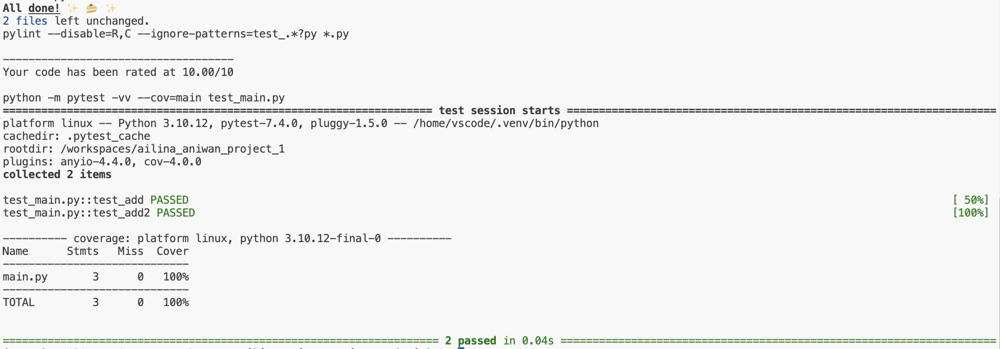

# IDS706 - Mini Project 1 - Ailina Aniwan

## Python GitHub Template

This repository is used for my first Data Engineering assignment in IDS 706. It serves as a template for future assignments in this course.

This repository includes the following components:

* `.devcontainer`

* `Makefile`

* `requirements.txt`

* `README.md` 

* `githubactions` 

* `Dockerfile`

The purpose of this project is to demonstrate a basic Python program with a function called add(x, y) that takes two numbers as input. It rounds the first number up, rounds the second number down, and then returns their sum. The function is tested in the test_main.py file to ensure it works as expected.

